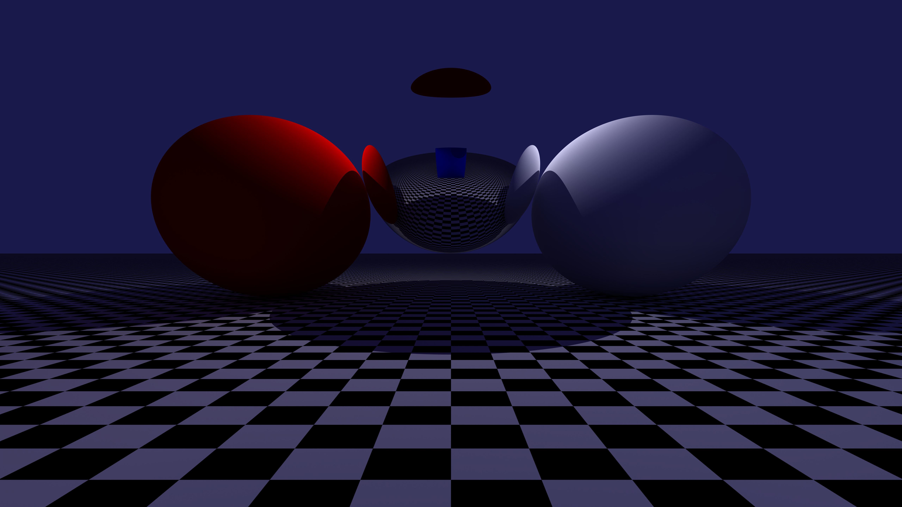
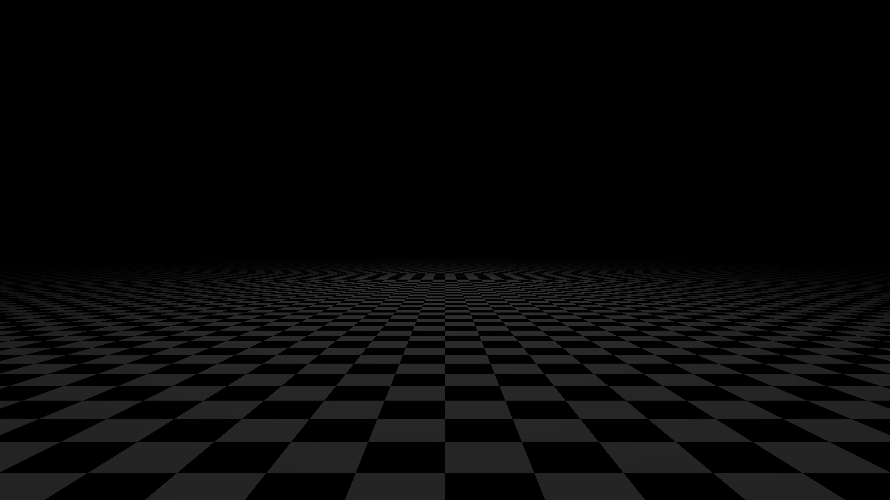
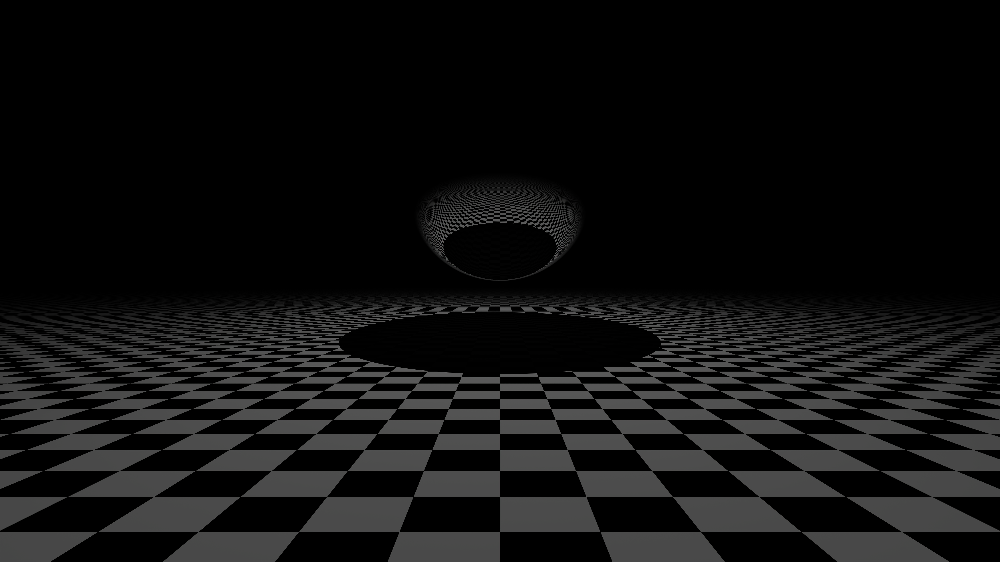
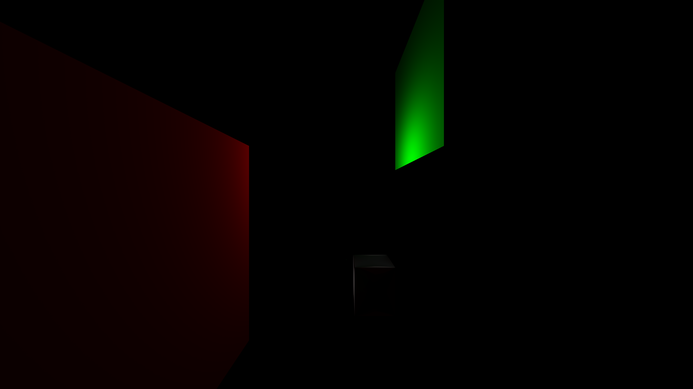

# this pathtracer has the following interesting features:
- [x] Importance Sampling

# usage
```bash
cargo run --release -- [--multiplier=N] [scene_file.toml] or --all
```

for example
```bash
cargo run --release -- --multiplier=2 scene.toml
```

or 
```bash
cargo run --release -- --all
```

for example scenes check the scenes folder